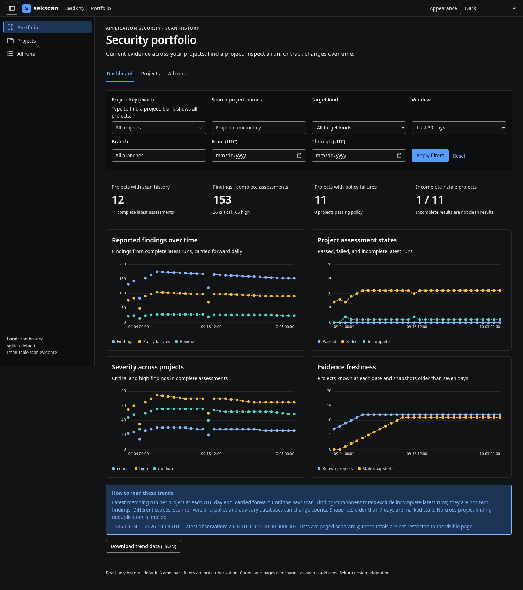

# sekscan

**Local and CI security assessment for application source, container images, and dependencies.**

sekscan is a Go command-line application that runs established security scanners,
combines their evidence, applies your security policy, and produces SBOMs and
searchable reports. Run it against a directory, a built image, a GitHub repository,
or a batch of projects. Store results locally in SQLite or share history through
PostgreSQL or Microsoft SQL Server.

**Current source: 0.6.5-preview.** This source package is not a verified production
binary distribution. It contains no scanner executables or vulnerability databases.
See [validation and limitations](TESTING.md) before deployment. Production dependencies
must be resolved and reviewed on a connected machine before publishing a release.

[Quick start](#quick-start) · [Scanners](#scanner-coverage) · [Batch and GitHub](#github-and-batch-scans) ·
[Configuration](#configuration) · [History](#dashboards-and-history) ·
[Troubleshooting](#semgrep-removal-and-existing-workspaces) · [Releases](#building-and-publishing-releases)

## What it does

| Capability | Behavior |
|---|---|
| Inventory and SBOMs | Syft package inventory, CycloneDX JSON, SPDX JSON, and native Syft JSON |
| Vulnerabilities | Grype matches packages to known advisories; optional secondary Trivy vulnerability analysis |
| Source and configuration checks | gosec, govulncheck, Gitleaks, Trivy, actionlint, zizmor, and Hadolint run where applicable |
| Application license policy | Application dependencies are evaluated against configured license rules; OS licenses are excluded from the application gate |
| Reports | Self-contained HTML, normalized JSON, SARIF, JUnit, Markdown, and policy decisions |
| Project history | Project-first navigation, pagination, filtering, trends, and comparisons between two runs |
| Portable operation | Managed scanner executables, runtimes, caches, and databases remain in the selected workspace |
| CI enforcement | Distinct exit codes for a completed pass, completed policy failure, and incomplete assessment |

The executable embeds its dashboard. There is no runtime CDN, external font,
Node.js frontend server, or MCP server requirement. The interface adapts the
[Sekura design system](https://github.com/mictsi/SekuraDesignMCP); attribution and
version information are in [third_party](third_party) and [the UI guide](docs/UI.md).



*The screenshot uses synthetic demonstration data, not verified vulnerabilities.*

## Quick start

### Get the application

Use a platform ZIP attached to a reviewed release, when available, and check its
SHA-256 against that release's `SHA256SUMS.txt`. Extract the **whole directory**.
Linux/macOS extractors may require `chmod +x sekscan` afterward.

The release builder supports Linux x86-64/ARM64, Windows x86-64/ARM64, and macOS
Intel/Apple Silicon. Scanner distribution and native-library compatibility must
also be verified for the machine used; a cross-compiled executable does not prove
that every scanner works on that platform.

To build this source preview, use the Go toolchain selected in `go.mod` on a
connected machine:

```bash
bash scripts/build.sh
./sekscan version
```

The source declares `go 1.26.0` and selects `go1.27.1`. The bootstrap script resolves
dependencies, runs tests/vet, and builds `./sekscan`. This preview has no fabricated
`go.sum`: review and commit the resolved `go.mod` and `go.sum` before tagging a
release. Do not disable Go module checksum verification.

Windows PowerShell, from the source directory:

```powershell
go mod tidy
if ($LASTEXITCODE -ne 0) { throw 'Dependency resolution failed' }
go mod verify
if ($LASTEXITCODE -ne 0) { throw 'Module verification failed' }
go test ./...
if ($LASTEXITCODE -ne 0) { throw 'Tests failed' }
go vet ./...
if ($LASTEXITCODE -ne 0) { throw 'Vet failed' }
$env:CGO_ENABLED = '0'
go build -trimpath -o sekscan.exe ./cmd/sekscan
if ($LASTEXITCODE -ne 0) { throw 'Build failed' }
```

### Prepare once, then scan

From the extracted application directory:

```bash
# Create files without overwriting existing configuration.
./sekscan init --home ./workspace

# Download managed tools/runtimes and their scanner data into that workspace.
./sekscan prepare --home ./workspace --all --with-java --yes

# Scan an absolute or relative directory. Use a stable project name.
./sekscan scan "dir:/path/to/application" \
  --project payments-api \
  --home ./workspace \
  --out ./security-report

# Browse every project and its stored runs in the selected namespace.
./sekscan serve --home ./workspace
```

On Windows, substitute `.\sekscan.exe` for `./sekscan`, for example:

```powershell
.\sekscan.exe scan 'dir:C:\work\payments-api' --project payments-api --home .\workspace --out .\security-report
.\sekscan.exe serve --home .\workspace
```

**`--home` selects tools, caches, logs, and history—not the directory being scanned.**
Use the same workspace and configuration for preparation and scanning. Run `serve`
separately even when the scan returns a policy failure; do not chain it with `&&`.

## Scanner coverage

| Tool | Purpose | Default applicability | Native settings |
|---|---|---|---|
| Syft | Inventory and SBOM generation | Supported directory/image/archive targets | `config/syft.yaml` |
| Grype | Dependency and OS-package vulnerabilities | Consumes the inventory from Syft | `config/grype.yaml` |
| Trivy | Secrets, misconfiguration, and license evidence | Supported filesystem/image inputs | `config/trivy.yaml` |
| Gitleaks | Secrets in the current files | Directory/rootfs snapshots; not Git history | Generated redacting configuration or reviewed override |
| actionlint | GitHub Actions syntax and expressions | Selected workflow files | `config/actionlint.yaml` |
| Hadolint | Dockerfile/Containerfile checks | Discovered Dockerfiles and name variants | `config/hadolint.yaml` |
| zizmor | GitHub workflow/action security | Discovered workflow/action YAML | Built-in offline audits; explicit extension for other settings |
| govulncheck | Go dependency vulnerabilities informed by call analysis | Selected modules with module-owned Go source | Managed Go SDK, dependency cache, and local vulnerability DB |
| gosec | Go source security checks | Selected modules with module-owned Go source | `config/gosec.json` |

Applicable source checks are enabled by default. Existing explicit `false` settings
are preserved. A non-Go target does not fail for absent Go tools; its Go checks are
**skipped / not applicable**. A genuine Go module with loading errors remains
incomplete. Syft failure blocks Grype—it does not mean Grype performed a clean scan.

General multi-language SAST is not bundled after Semgrep removal; an external
SARIF analyzer can be configured separately. Go source analysis remains available.
Build constraints, file-size limits, and exclusions can limit coverage. Trivy's
secondary vulnerability scanner is disabled by default to reduce overlap.

See [default scanner behavior](docs/DEFAULT-SCANNERS.md) and [extension contracts](docs/EXTENSIONS.md).

## Targets and reports

```bash
./sekscan scan dir:../application --project payments-api --home ./workspace
./sekscan scan image:my-service:build-123 --project payments-api --home ./workspace --out ./image-report
./sekscan scan docker-archive:./image.tar --project payments-api --home ./workspace
./sekscan scan rootfs:./unpacked-image --project payments-api --home ./workspace
./sekscan scan sbom:./previous-sbom.json --project payments-api --home ./workspace
```

Typed target shorthand is also supported: `./sekscan dir:/path --project my-service`.
Image and archive support depends on the selected scanners. A Dockerfile alone is
not a scan of the built image. SBOM-only scans cannot inspect source files for secrets.

Reports are written to `--out`:

```text
security-report/
├── index.html
├── results.json
├── findings.sarif
├── junit.xml
├── summary.md
├── policy-results.json
├── sbom.syft.json
├── sbom.cdx.json
└── sbom.spdx.json
```

SBOM exports require successful inventory. Partial reports preserve available evidence
and scan-health failures. Early configuration/input failures may prevent report creation.
Open `index.html` directly or run `./sekscan serve ./security-report`.

## GitHub and batch scans

GitHub mode downloads a commit snapshot without requiring a host Git installation:

```bash
./sekscan github https://github.com/mictsi/SekuraDesignMCP --home ./workspace
./sekscan github mictsi/SekuraDesignMCP --project design-system --ref main --home ./workspace
```

The inferred project key is lowercase `owner/repository`. Set `--project` to reuse an
existing local project's history. Private-repository credentials come from `GITHUB_TOKEN`
or the configured token environment variable, not a committed URL. Tokens are not
forwarded to scanner processes. Repository scripts are not run. Snapshot limitations,
including skipped submodules/links/LFS content, are recorded as coverage issues.

One JSON schema supports local and GitHub entries. Save `projects.json`:

```json
{
  "version": 1,
  "continue_on_error": true,
  "projects": [
    { "project": "payments-api", "path": "../payments-api" },
    { "repo_url": "https://github.com/mictsi/SekuraDesignMCP" }
  ]
}
```

```bash
./sekscan batch validate projects.json
./sekscan batch projects.json --dry-run
./sekscan batch projects.json --home ./workspace --out ./batch-reports
```

Relative paths resolve against the JSON file's directory. Batches run sequentially,
produce separate project reports, and include a `batch-results.json` summary.
Use `--fail-fast` to stop after the first nonzero result.
See [the batch guide](docs/BATCH.md) and [canonical schema](schema/batch.schema.json).

## Configuration

`sekscan.json` is strict JSON; unknown fields are rejected. Local discovery checks
explicit `--config`, `SEKSCAN_CONFIG`, the current directory, then the executable's
directory. `--home` confines discovery to that workspace. `--no-config` disables it.
Configuration from an independently supplied target directory is **not** loaded implicitly.

In CI, select trusted configuration explicitly with `--config` or `SEKSCAN_CONFIG`.
A pull request must not be allowed to replace its scanner executables or weaken its
own enforcement policy. Explicit selection is a trust decision, not a sandbox.

```json
{
  "version": 2,
  "portable": true,
  "project": { "namespace": "engineering", "key": "payments-api" },
  "tools": {
    "hadolint": {
      "version": "latest",
      "native_config": "config/hadolint.yaml"
    }
  },
  "checks": { "hadolint": true, "trivy_vulnerabilities": false },
  "policy": { "fail_at": "high", "fail_on_review": true }
}
```

Omitted fields inherit defaults. `tools` controls installations and native settings;
`checks` controls analyses; `policy` controls the final decision. Native paths are
relative to the selected configuration file. Workspace paths are relative to `--home`.
See [the complete example](examples/workspace-sekscan.json).

```bash
./sekscan config show --home ./workspace
./sekscan config validate --home ./workspace

# Create a separate expanded configuration; retain existing policies and pins.
./sekscan config enable-default-scanners \
  --config ./workspace/sekscan.json \
  --out ./workspace/sekscan-expanded.json
```

Custom `extensions[]` definitions and managed installation recipes remain supported.
An explicit same-name extension overrides the built-in adapter; remove an obsolete
override only after reviewing it. Configurable execution does not make every arbitrary
output format understandable—custom analyzers must satisfy a supported parser contract.

## Portable workspace and updates

```text
workspace/
├── sekscan.json
├── config/                  Reviewed scanner configurations and rules
├── bin/<tool>/<version>/    Executables and complete managed runtime bundles
├── cache/                   Scanner DBs, source snapshots, and tool caches
├── logs/                    Application logs; opt-in private diagnostics
└── data/sekscan.db          Local scan history
```

```bash
./sekscan deps check --home ./workspace --all --json
./sekscan prepare --home ./workspace --all --update-tools --with-java --yes
./sekscan deps status --all --home ./workspace --json
./sekscan deps lock --home ./workspace --out ./workspace/sekscan.lock.json
./sekscan db status --home ./workspace --all --with-java
./sekscan db export --home ./workspace --out ./scanner-data.tar.gz
```

Normal scans do not silently upgrade executables. Managed copies are used even when
tools exist on the host PATH. `prepare --all` means all configured tools, not every
possible scanner. Installations require suitable upstream native builds/binary wheels.
Checksum verification does not constitute publisher-signature verification.

For offline use, prepare on a connected machine, stop all writers, and copy the
**entire workspace and executable** to a compatible OS/architecture. Then scan with
`--offline`. Target files, dependencies, rules, and fresh-enough databases must already
be available. Offline options are not an operating-system network sandbox.

Go modules may need explicit dependency preparation:

```bash
./sekscan prepare --home ./workspace --go-module /path/to/go-module --yes
```

This runs `go mod download all` using the managed SDK and can update `go.sum`; review
changes. Scans do not automatically run `go mod tidy`, build scripts, generators, or
tests. No Go preparation is necessary for a non-Go target.
See [portability](docs/PORTABLE.md) for complete runtime and database constraints.

## Dashboards and history

```bash
./sekscan serve --home ./workspace
./sekscan serve --home ./workspace --project payments-api
./sekscan history projects --home ./workspace --page 1 --page-size 25 --json
./sekscan history list --home ./workspace --project payments-api --page 2 --page-size 25 --json
./sekscan history compare BASE_RUN_ID HEAD_RUN_ID --home ./workspace --project payments-api --out ./comparison.json
```

The default view includes all projects in the configured database namespace. Tabs
separate dashboards from pageable lists: portfolio, projects, runs, comparisons,
findings, licenses, inventory, and scan health. A project-restricted viewer does not
permit another project's artifacts to be retrieved through its API.

Portfolio totals use the latest matching run per project, not a sum of all history.
Incomplete runs are visible and are not treated as clean zero-finding assessments.
Comparisons preserve coverage warnings; “no longer reported” is not proof of remediation.
The server is read-only and loopback-only, not an authenticated multi-user platform.
See [the history guide](docs/HISTORY.md).

## SQLite, PostgreSQL, and SQL Server

SQLite is the default local history store. For a shared server, use `storage.driver`
`postgres` or `mssql` and provide credentials through an environment variable:

```json
{
  "version": 2,
  "project": { "namespace": "engineering" },
  "storage": {
    "driver": "postgres",
    "dsn_env": "SEKSCAN_DB_DSN",
    "auto_migrate": false,
    "required": true
  }
}
```

```bash
# Supply SEKSCAN_DB_DSN securely before running these commands.
./sekscan storage migrate --home ./workspace --config ./shared.json
./sekscan storage status --home ./workspace --config ./shared.json
./sekscan scan dir:../application --project payments-api --home ./workspace --config ./shared.json
```

Migrate shared schemas with an administrative identity; scan jobs should not need
schema-management privileges. A project is identified by **namespace + project key**;
use the same key in local and CI runs. Namespace filtering is not access control.

SQL schemas are in [schema/](schema), with [database documentation](docs/DATABASE.md).
Scanner vulnerability caches are distinct from the history database. PostgreSQL and
SQL Server services are not bundled or provisioned by `prepare`.

## CI usage and exit codes

| Exit | Meaning |
|---|---|
| `0` | Required scanning completed and policy passed |
| `1` | Required scanning completed but policy failed |
| `2` | Operational failure or incomplete required coverage |

Use the same command on local agents, GitHub Actions, or Azure DevOps:

```bash
./sekscan scan dir:. --project payments-api --ci \
  --home /path/to/prepared-workspace \
  --config /path/to/trusted/sekscan.lock.json \
  --out ./security-report
```

Publish reports even when the scan step fails (`if: always()` on GitHub Actions;
`condition: always()` on Azure DevOps). Do not hide failure with `|| true`.
[Pipeline examples](examples) show artifact publication and scanner preparation.

## Semgrep removal and existing workspaces

Semgrep support was removed in **0.6.5-preview**. Scans, `prepare --all`, update
checks and default prerequisite status no longer select it. The Python runtime
installer, launcher, native self-test and starter rules are no longer shipped.
There is no Semgrep replacement automatically enabled: general multi-language SAST
now requires a separately configured analyzer. Go SAST remains available via gosec.

Older `checks.semgrep` settings (true or false), Semgrep tool definitions and named
Semgrep extensions are ignored with a migration warning. Their unused built-in uv
helper is removed from the effective configuration too. Other scanners, policies,
version pins, custom integrations and database settings are preserved.

An optional cleanup command writes a **new** configuration without retired entries:

```bash
./sekscan config remove-semgrep --home ./workspace \
  --out ./workspace/sekscan-clean.json
./sekscan prepare --home ./workspace \
  --config ./workspace/sekscan-clean.json --all --yes
```

Rebuilding and using the new executable is enough; rewriting the configuration is
not required. Batch manifests still accept the deprecated boolean `semgrep` key as
an ignored compatibility field. The CLI flag `--semgrep` and native `deps test`
command are removed. An explicit `deps install semgrep` request returns a removal
message without downloading anything.

No scan history, findings, scanner files or caches are deleted automatically.
Historical Semgrep findings remain visible; removing a scanner does not establish
that its previous findings were fixed. No SQL migration is required. Old private
Semgrep logs should not be shared or published as normal artifacts.


## Building and publishing releases

The repository includes [`.github/workflows/release.yml`](.github/workflows/release.yml).
It runs **only when a GitHub release is published**, including a prerelease. Pushing
a branch or tag, opening a pull request, saving a draft, or editing release notes
does not publish binaries.

Before publishing, commit the workflow, its helper scripts, all intended source
changes, and a reviewed, resolved `go.mod`/`go.sum`. Tag that commit, then publish a
GitHub release for the tag. The workflow builds the event's exact tagged commit,
not the default branch or whichever commit is latest later.

The canonical target list is [`scripts/release/targets.json`](scripts/release/targets.json).
Both packaging and publication validation consume that file, including Windows ARM64.

Each release gets six platform ZIPs, a source ZIP, documentation, `release.json`,
`release-source.json`, and `SHA256SUMS.txt`. Tests and packaging must finish before
the publication job starts. Binaries and archive names take their version from the
tag, with an optional leading `v` removed. Existing nonmatching assets are never
replaced. Uploads are individually committed by GitHub, so a network failure may
leave a partial set; retries accept only already-uploaded assets with matching hashes.

**Published-only asset upload requires a mutable release.** GitHub immutable releases
cannot accept new assets after publication. This workflow fails explicitly in that
case; it does not turn immutability off. Use an approved draft-build-upload-publish
process for immutable releases instead. See [release workflow details](docs/RELEASE-WORKFLOW.md).

For an explicit local build after dependency review:

```bash
bash scripts/build-release.sh --version 0.6.5-preview --targets all
```

The ZIPs contain sekscan and documentation, **not predownloaded scanner runtimes or
CVE databases**. They are unsigned. Cross-compilation is not native-platform or
live-database acceptance. See [release builder](docs/RELEASING.md).

## Limitations and security boundaries

sekscan orchestrates evidence; it does not prove an application is secure. License
outcomes are organizational policy checks, not legal advice. Scanners, rules, caches,
and module metadata determine coverage. Real package-loading errors are not skipped
as “not applicable.” Saved history means the assessment was persisted, not passed.

Configuration can authorize program execution. Review tool definitions, version pins,
rules, and exceptions. File containment checks and argument arrays do not sandbox
upstream executables. Runtime portability requires compatible native libraries and
architectures. See [security notes](docs/SECURITY.md), [validation](TESTING.md),
[change history](CHANGELOG.md), and [third-party notices](third_party).
